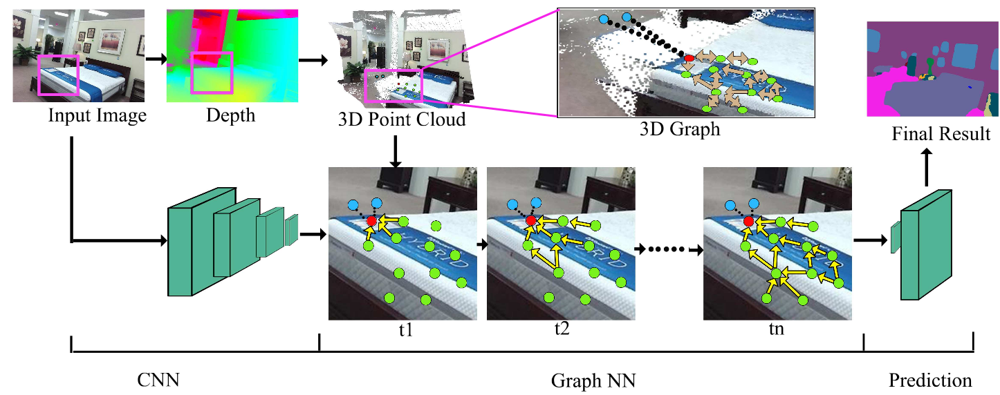

# 3DGNN
This is a Caffe implementation of 3DGNN 



## Setup

### Requirement
Required CUDA (7.0) + Ubuntu14.04.

### Installation

For installation, please follow the instructions of [Caffe](https://github.com/BVLC/caffe) and [DeepLab v2](https://bitbucket.org/aquariusjay/deeplab-public-ver2).

### Data Preparation
1. Download the provided data (https://)
2. Download the training data (prepared hdf5 data) (https://...)
3. Download the testing data  (https://..)

### Usage

1. Clone the repository.

2. Build Caffe and matcaffe:

   ```shell
   cd caffe_code
   vim Makefile.config
   make -j8 && make matcaffe
   ```

3. Inference:

   - Evaluation code is in folder 'matlabscript'. 
   - Download trained models and unzip it. Pretrained model is saved in folder "model/nyu_40/". 
   ```shell
   cd matlabscript
   run nyu_crop_data_mask_msc.m
   ```
   - The result is saved in folder "../result/nyu_40_msc/"
4. Training
1. Training data preparation
   cd matlabscript
   run generatedata by setting training = true
   cd ..
   cd train_data_hdf5_file_generate
   python generate_hdf5
   cd ..
2. Run caffe training

   
## Citation
If you use our code for research, please cite our paper:

Xiaojuan Qi, Renjie Liao, Jiaya Jia, Sanja Fidler and Raquel Urtasun. 3D Graph Neural Network for RGBD Semantic Segmentation. In ICCV 2017.

## Question
If you have any question or request about the code and data, please email me at qxj0125@gmail.com . If you need more information for other datasets plesase send email. 

## License
MIT License
